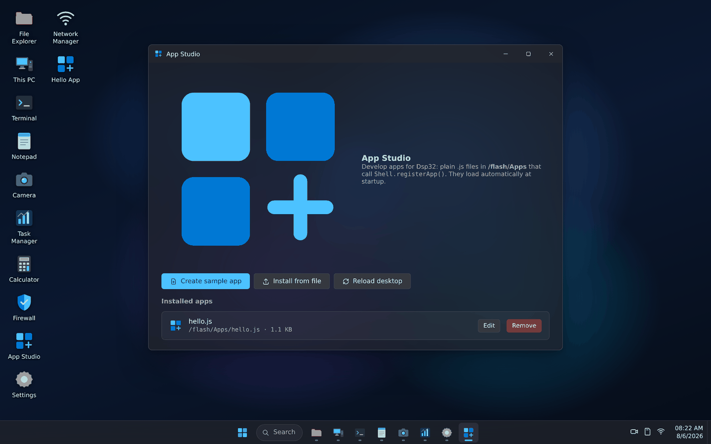

<div align="center">


# Dsp32 — Firmware

**Ready-to-flash firmware images for the Dsp32 web desktop OS.**

Turn any ESP32 into a self-contained computer with its own Wi-Fi hotspot
and a full Windows 11-style desktop in the browser.

[](https://github.com/AliAkrami1375/Dsp32-firmware/releases/latest)
[](LICENSE)
[](#pick-your-board)

**English** · [فارسی](README.fa.md)


</div>

---

This repository holds **prebuilt binaries and flashing documentation only**.
No toolchain, no build step, no source. Download one file, flash it, and the
board is running a desktop.

> Looking for the source code, the simulator, or want to build it yourself?
> That lives at **[AliAkrami1375/Dsp32](https://github.com/AliAkrami1375/Dsp32)**.

## What you get

Flash Dsp32 and the board raises its own Wi-Fi hotspot, runs a captive portal,
and serves a complete desktop to any phone or laptop that connects — no app to
install, no internet needed. The entire interface is baked into the firmware.

| | |
|---|---|
| **Hotspot desktop** | Join the AP, and the desktop opens by itself on most devices |
| **Hardware auto-detection** | The boot splash probes chip, cores, clock, heap, PSRAM, flash, SD card and camera, and reports what it found |
| **Twelve apps** | File Explorer, This PC, Terminal, Notepad, Camera, Task Manager, Calculator, Firewall, Network Manager, App Studio, Settings, Photos |
| **Real windows** | Drag, resize, snap to half-screen, maximize, minimize, taskbar grouping, context menus |
| **Storage** | Internal flash plus SD card — upload, download, rename, delete, drag-and-drop |
| **Camera** | Live MJPEG stream and capture, on boards that have one |
| **Network + firewall** | Change hotspot credentials, join an uplink router, block clients by MAC |
| **Extensible** | Drop a `.js` file on the device and it becomes a desktop app |

## Screenshots

<table>
<tr>
<td width="50%"><br><sub><b>Boot</b> — the firmware probes and reports every peripheral it finds</sub></td>
<td width="50%"><br><sub><b>Start menu</b> — searchable, with all installed apps</sub></td>
</tr>
<tr>
<td><br><sub><b>File Explorer</b> — flash and SD, upload by drag-and-drop</sub></td>
<td><br><sub><b>Task Manager</b> — live heap chart, temperature, storage</sub></td>
</tr>
<tr>
<td><br><sub><b>Terminal</b> — 19 commands over the device REST API</sub></td>
<td><br><sub><b>Network</b> — hotspot credentials, scan and join an uplink</sub></td>
</tr>
<tr>
<td><br><sub><b>Camera</b> — live view and capture to storage</sub></td>
<td><br><sub><b>App Studio</b> — write and install your own apps</sub></td>
</tr>
<tr>
<td><br><sub><b>Window snapping</b> — drag to an edge or press <code>Win</code>+<code>←</code>/<code>→</code></sub></td>
<td><br><sub><b>Light theme</b> — eight accent colors, five wallpapers</sub></td>
</tr>
</table>

<div align="center">

<br><sub>The desktop adapts to phones — the most likely device to be connected to an ESP32 hotspot</sub>
</div>

## Pick your board

| Your board | Download | Camera | SD card |
|---|---|---|---|
| Generic ESP32 (DevKit, WROOM, WROVER) | [`esp32`](firmware/esp32/) | — | SPI, GPIO5 CS |
| AI-Thinker ESP32-CAM | [`esp32cam`](firmware/esp32cam/) | ✅ OV2640 | ✅ SDMMC |
| ESP32-S2 | [`esp32s2`](firmware/esp32s2/) | — | SPI |
| Generic ESP32-S3 | [`esp32s3`](firmware/esp32s3/) | — | SPI |
| Seeed XIAO ESP32S3 Sense | [`xiao_s3_sense`](firmware/xiao_s3_sense/) | ✅ OV2640 | ✅ SPI, GPIO21 CS |
| ESP32-C3 | [`esp32c3`](firmware/esp32c3/) | — | SPI |
| ESP32-C6 | [`esp32c6`](firmware/esp32c6/) | — | SPI |

Each folder contains:

| File | What it is |
|---|---|
| `dsp32-<variant>-merged.bin` | **Use this one.** Bootloader + partition table + app in a single image. Flash at offset `0x0`. |
| `bootloader.bin` · `partition-table.bin` · `dsp32-<variant>.bin` | The three parts separately, for tools that want them that way. |

Verify any download against [`SHA256SUMS.txt`](SHA256SUMS.txt).

## Flash it

**The quick way** — clone this repo and let the script pick the image, the
offset and the serial port for you:

```bash
git clone https://github.com/AliAkrami1375/Dsp32-firmware.git
cd Dsp32-firmware
./flash.sh
```

**Or do it yourself:**

```bash
pip install esptool
esptool.py -p /dev/ttyUSB0 -b 460800 write_flash 0x0 dsp32-esp32-merged.bin
```

On Windows the port looks like `COM5`; on macOS like `/dev/cu.usbserial-0001`.

Prefer a GUI? Use Espressif's **ESP Flash Download Tool**, or flash straight
from Chrome at [esp.huhn.me](https://esp.huhn.me/) with nothing installed.

**Settings any tool will ask for:** SPI mode **DIO** · speed **40 MHz** ·
flash size **4 MB** · baud **460800**

**Memory offsets** — only needed if you flash the three files separately. The
bootloader offset differs between chips, and getting it wrong is the most
common cause of a boot loop:

| Chip | bootloader.bin | partition-table.bin | app |
|---|---|---|---|
| ESP32, ESP32-S2 | `0x1000` | `0x8000` | `0x10000` |
| ESP32-S3, C3, C6 | `0x0` | `0x8000` | `0x10000` |

The merged image sidesteps all of this — it goes at `0x0` on every chip.

📖 **[Full flashing guide](docs/FLASHING.md)** — step-by-step for every tool,
ESP32-CAM wiring, how to enter download mode, and troubleshooting.

## First boot

1. Join the Wi-Fi network **`Dibachain`**, password **`dsp32pass`**
2. Most devices open the desktop automatically (captive portal). Otherwise
   browse to **http://10.3.2.1** or **http://dsp32.local**

The first boot shows a splash that probes the hardware and reports what it
found, then the desktop appears.

Everything is configurable from the Settings app afterwards: hotspot name and
password, theme, accent color, wallpaper, Wi-Fi uplink and storage.

## Try it without hardware

The full desktop runs on your computer against a simulated device:

```bash
git clone https://github.com/AliAkrami1375/Dsp32.git
cd Dsp32
python3 simulator/dsp32_sim.py
# open http://localhost:8000
```

## Footprint

Measured on the classic ESP32 build:

```
Application binary     942 KB      63% of the app partition still free
Embedded desktop        48 KB      gzipped, 162 KB uncompressed
Static DRAM             34 KB      19% used
Static IRAM             88 KB      69% used
```

## Requirements

- Any ESP32-family board, 4 MB flash or more
- Optional: SD card, OV2640 camera, PSRAM
- A USB cable that carries data (many are charge-only)

## License

MIT — see [LICENSE](LICENSE). Source: [AliAkrami1375/Dsp32](https://github.com/AliAkrami1375/Dsp32)
