# Dsp32 — release 1.1.0

*[فارسی](README.fa.md)*

Prebuilt firmware for the ESP32 family, the Di8266 node image, and every
installable app.

### ▸ [Try it in your browser](demo/)

The desktop is the real one. The device behind it is imitated in the page, so
there is nothing to flash and nothing to install — files and settings are kept
in your browser and survive a reload.

<p align="center">
  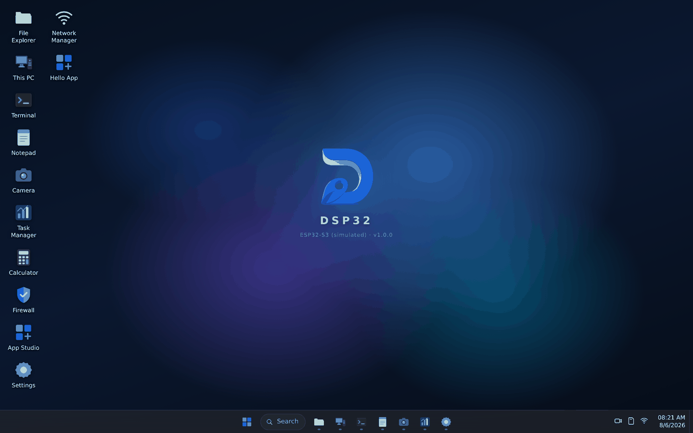
</p>

<table>
<tr>
<td width="50%">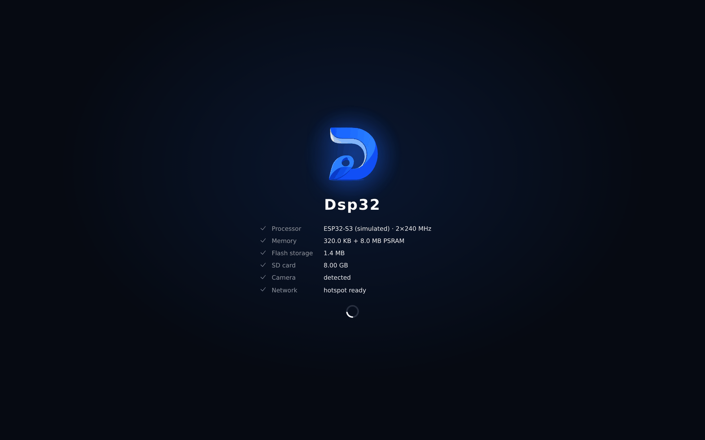<br>
  <sub><b>Boot</b> — the firmware probes and reports every peripheral it finds</sub></td>
<td width="50%">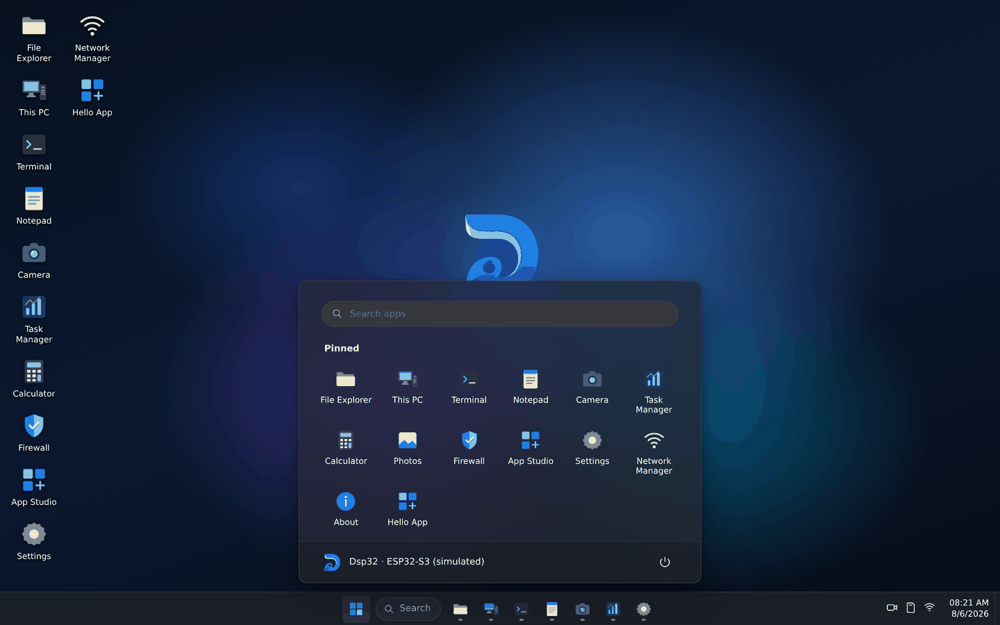<br>
  <sub><b>Start menu</b> — searchable, with everything installed</sub></td>
</tr>
<tr>
<td>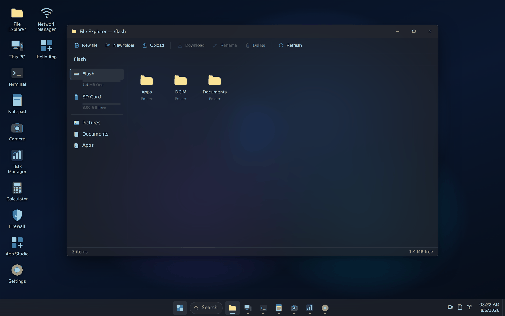<br>
  <sub><b>File Explorer</b> — flash and SD, upload by drag-and-drop</sub></td>
<td>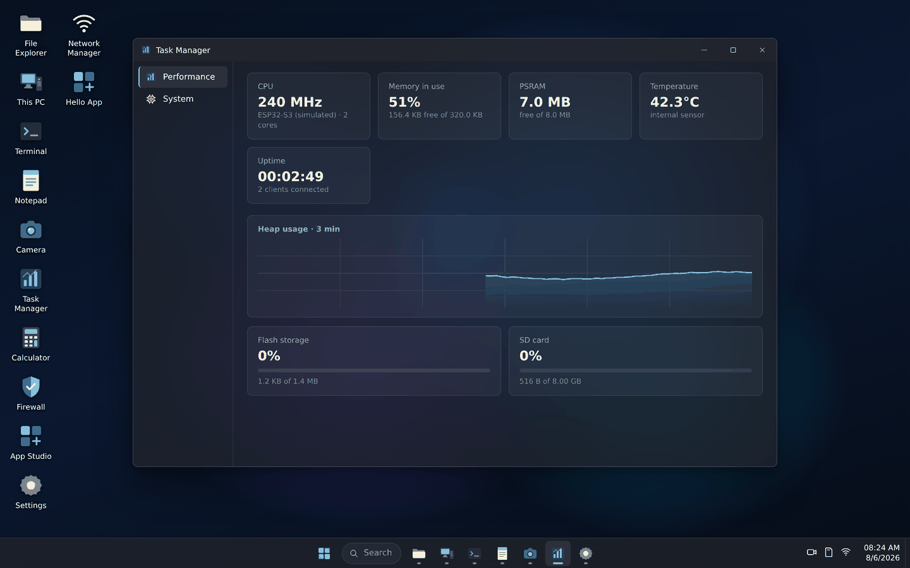<br>
  <sub><b>Task Manager</b> — live heap chart, temperature, storage</sub></td>
</tr>
<tr>
<td>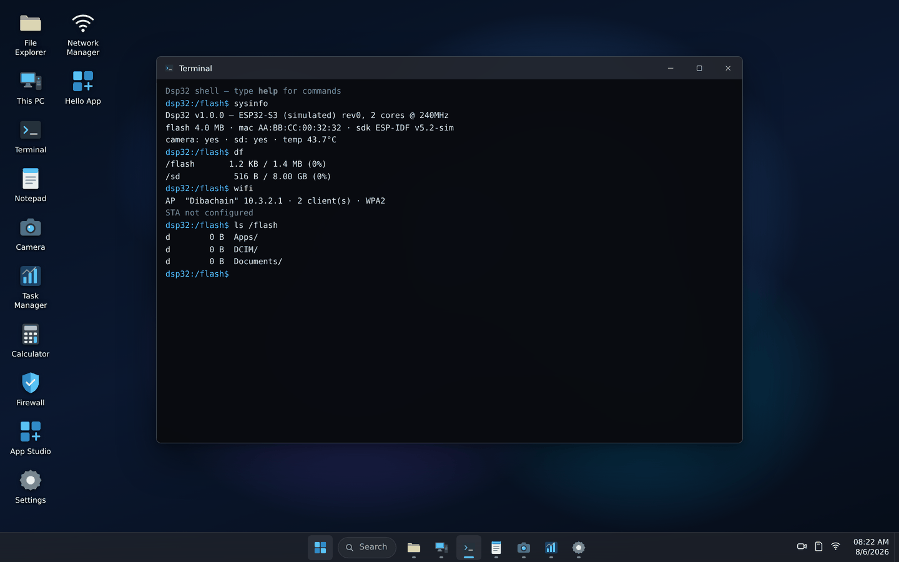<br>
  <sub><b>Terminal</b> — the device REST API from a command line</sub></td>
<td>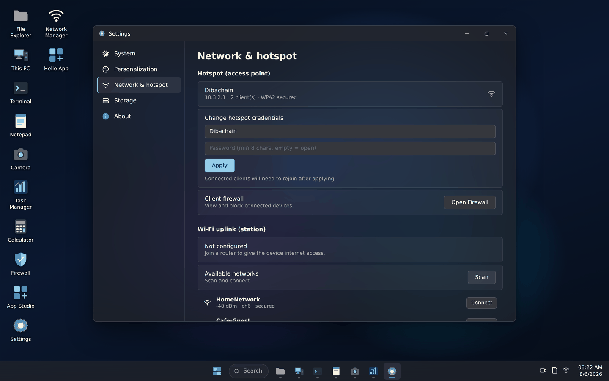<br>
  <sub><b>Network</b> — hotspot credentials, scan and join an uplink</sub></td>
</tr>
<tr>
<td>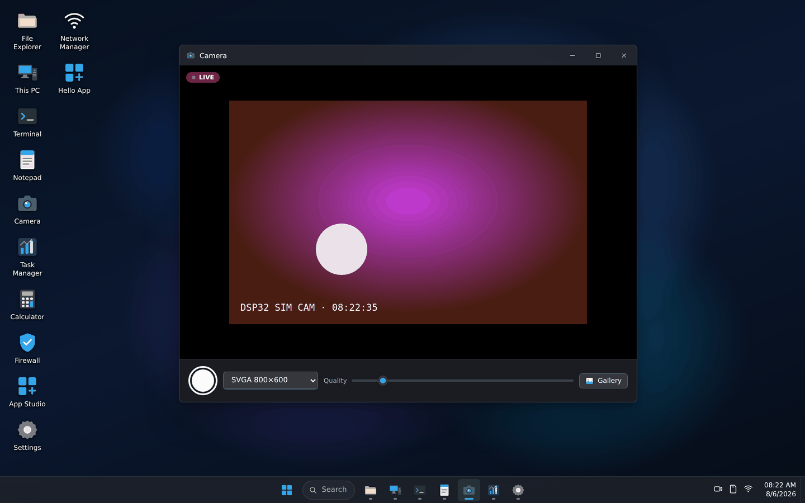<br>
  <sub><b>Camera</b> — live view and capture, on boards that have one</sub></td>
<td>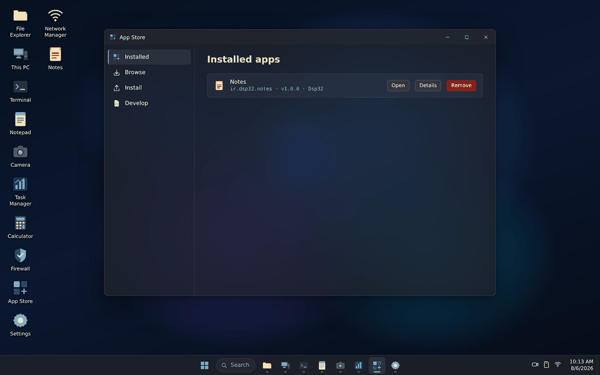<br>
  <sub><b>App Store</b> — install from the registry, an SD card or a file</sub></td>
</tr>
<tr>
<td>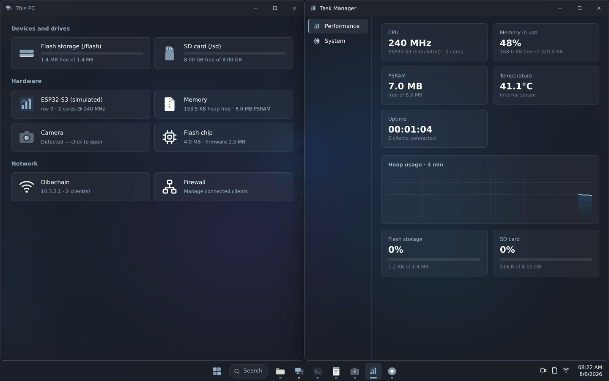<br>
  <sub><b>Window snapping</b> — drag to an edge or press <code>Win</code>+<code>←</code>/<code>→</code></sub></td>
<td>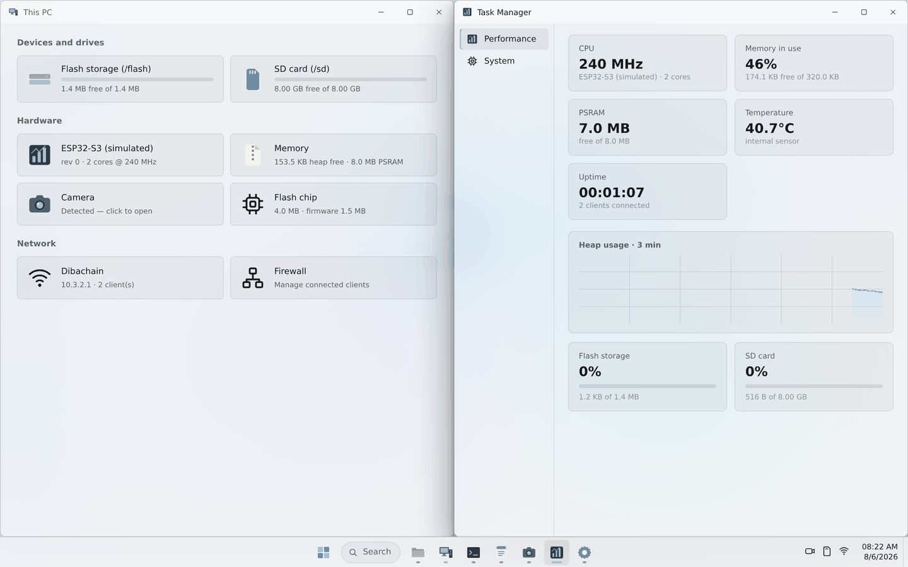<br>
  <sub><b>Light theme</b> — eight accents, five wallpapers</sub></td>
</tr>
</table>

<p align="center">
  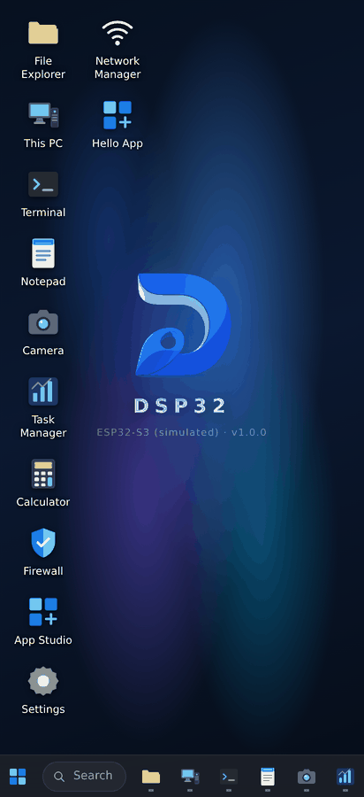<br>
  <sub>A phone is the most likely thing connected to an ESP32 hotspot, so it is
  built for one.</sub>
</p>

**There is no source here.** This repository holds what a board needs to run:
images to flash, packages to install, and the documentation. It is public
because a board fetches its app registry and the node firmware over plain
HTTPS with no credentials, and those files have to be readable without a
token.

---

## Flash a board

Every board has a **merged** image that goes on at offset 0 in one command —
that is the one to use unless you have a reason not to.

```bash
pip install esptool
esptool.py --chip auto -p /dev/ttyUSB0 -b 460800 write_flash 0x0 \
    firmware/<board>/dsp32-<board>-merged.bin
```

Or use the script, which picks the port and the chip for you:

```bash
./flash.sh <board>
```

| Board | Files | Merged image | Notes |
|---|---|---|---|
| **ESP32** | `firmware/esp32/` | 1.4 MB | The original dual-core part. 4 MB flash, no PSRAM assumed. |
| **ESP32-C3** | `firmware/esp32c3/` | 1.4 MB | RISC-V, single core. No camera interface on this part. |
| **ESP32-C6** | `firmware/esp32c6/` | 1.4 MB | RISC-V with Wi-Fi 6. No camera interface. |
| **AI-Thinker ESP32-CAM** | `firmware/esp32cam/` | 1.4 MB | ESP32 with the camera pins and PSRAM enabled. |
| **ESP32-S2** | `firmware/esp32s2/` | 1.4 MB | Single core, native USB, no Bluetooth. |
| **ESP32-S3** | `firmware/esp32s3/` | 1.4 MB | Dual core with PSRAM. The most comfortable board to run this on. |
| **Seeed XIAO ESP32S3 Sense** | `firmware/xiao_s3_sense/` | 1.4 MB | S3 with the Sense camera and SD wiring. |

The individual `bootloader.bin`, `partition-table.bin` and app images are
beside each merged file for anyone who needs to write them separately.

Full instructions, including every flashing tool and the offsets each one
wants, are in **[docs/FLASHING.md](docs/FLASHING.md)**.

### After flashing

The board raises a Wi-Fi network called **Dibachain**. Join it and open
**http://10.3.2.1** — a captive portal should offer it automatically.

---

## Apps

None of them are in the firmware. The board downloads what you ask for, which
is why a 1.4 MB image can carry a desktop at all.

The App Store on the board reads `apps/registry.json` from this repository, so
anything published here is installable from the device with no further setup.

| App | Version | What it does |
|---|---|---|
| **Clock** | 1.0.0 | Clock, stopwatch, countdown timer and alarms. |
| **Code** | 1.0.0 | A code editor for the device: file tree, tabs, syntax highlighting, line numbers, find and replace, auto-indent and… |
| **Diba Manager** | 2.0.0 | Visual pin manager and flow editor. |
| **Dmesh** | 2.2.0 | Central control for Di8266 nodes. |
| **Media Server** | 1.0.0 | Serves a folder on the SD card as a web library on its own port, with playback, file management and an optional password. |
| **Notes** | 1.0.0 | Quick notes kept on the device. Demonstrates storage, filesystem access and notifications from a packaged app. |
| **Snake** | 1.0.0 | The classic game. |
| **Soroush** | 1.0.0 | A Soroush Plus messenger for the board. |

A `.dib` is the install package. You can also install one by hand: put it on
the SD card or upload it in **App Store → Install**.

---

## The Di8266 node

An ESP8266 client that Dsp32 discovers, claims and drives — its own key, its own rules, and pins the board can read and write over the Dmesh protocol.

| | |
|---|---|
| **Image** | `node/di8266.bin` |
| **Version** | 2.1 |
| **Protocol** | Dmesh v2 |
| **Size** | 320,512 bytes |
| **SHA-256** | `1976ab084d9b8647513ca499d5c8c72399e8226d803df7d8da84301e040a5b64` |

A blank ESP8266 can be flashed straight from the **Dmesh** app over four
wires — no computer needed. Everything after that is over the air. See
**[docs/DMESH.md](docs/DMESH.md)**.

---

## Documentation

| | |
|---|---|
| [Flashing](docs/FLASHING.md) | Every tool, every board, every offset |
| [Dmesh](docs/DMESH.md) | Driving ESP8266 nodes, and the protocol behind it |
| [Media Server](docs/MEDIA_SERVER.md) | Serving a folder on the card as a web library |
| [App development](docs/APP_DEVELOPMENT.md) | Writing your own apps |
| [.dib format](docs/DIB_FORMAT.md) | What an app package is |

Every document has a Persian version beside it.

---

## Checksums

`SHA256SUMS.txt` covers every image and package in this release.

```bash
sha256sum -c SHA256SUMS.txt
```
